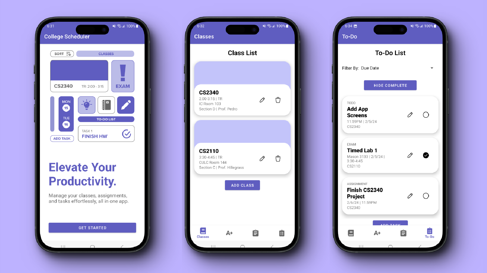

# College Scheduler

College Scheduler is an Android app, built using Java, that helps students manage their academic schedules. Students can add their classes, assignments, exams, and upcoming tasks that they need to work on, with functionality for sorting and filtering items. This project was built for Georgia Tech class CS2340.

### Views
- Separate pages for viewing classes, assignments, and exams
- Overview page with all assignments, exams, and tasks in a single to-do list

### Functionality
- View, add, edit, and delete classes and items (assignments, exams, tasks)
- Sort items by name, due date, or course
- Mark items as complete
- Filter items by whether they are complete or not

### Data Fields
- Classes:
    - Class name
    - Time and days of the week
    - Room and location
    - Section
    - Professor
- Assignments:
    - Assignment name
    - Due date and time
    - Course
- Exams:
    - Exam name
    - Date and time
    - Course
    - Location
- Tasks:
    - Task name
    - Due date and time
    - Course
